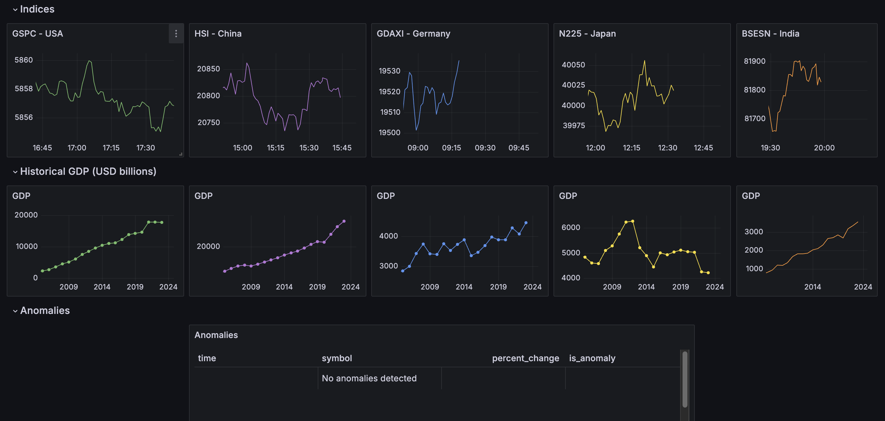

# **GlobalMarketStream**

**Real-time Global Stock Data Streaming, Processing, and Anomaly Detection Pipeline**

## **Table of Contents**

- [Introduction](#introduction)
- [Features](#features)
- [Architecture Overview](#architecture-overview)
- [Technologies Used](#technologies-used)
- [Setup and Installation](#setup-and-installation)
  - [Prerequisites](#prerequisites)
  - [Installation Steps](#installation-steps)
- [Usage](#usage)
- [Testing](#testing)
- [Deployment on AWS](#deployment-on-aws)
- [Visualization Dashboard](#visualization-dashboard)
- [Future Enhancements](#future-enhancements)
- [License](#license)


---

## **Introduction**

**GlobalMarketStream** is a real-time data pipeline that streams, processes, and analyzes stock market data from the current top 5 economies in the world. The project implements a scalable architecture using Apache Kafka, Apache Spark, PostgreSQL, and Grafana to perform real-time data ingestion, processing, anomaly detection, and visualization.

<div align="center">
    
</div>


## **Features**

- **Real-Time Data Streaming**: Ingests live stock data from multiple global markets.
- **Data Processing with Spark**: Processes and transforms data using Apache Spark Structured Streaming.
- **Anomaly Detection**: Implements statistical methods to detect anomalies in stock prices.
- **Data Storage**: Stores processed data in a PostgreSQL database.
- **Visualization Dashboard**: Interactive Grafana dashboards for real-time data visualization.
- **Automated Testing**: Comprehensive unit tests using pytest.
- **Continuous Integration**: GitHub Actions for automated testing and code quality checks.

---

## **Architecture Overview**

1. **Data Ingestion**:
   - **Source**: Stock market indices data from Yahoo Finance API.
   - **Producer**: `real_time_data_stream.py` fetches data and sends it to Kafka topics.

2. **Message Broker**:
   - **Apache Kafka**: Manages data streams and ensures reliable message delivery.

3. **Data Processing**:
   - **Apache Spark**: `spark_processing.py` consumes data from Kafka, processes it, detects anomalies, and writes to PostgreSQL.

4. **Data Storage**:
   - **PostgreSQL**: Stores processed stock data for historical analysis.

5. **Data Visualization**:
   - **Grafana**: Connects to PostgreSQL and visualizes data on interactive dashboards.

6. **Monitoring and Alerts** (Future Enhancement):
   - **Prometheus**: For system monitoring and alerting.

---

## **Technologies Used**

- **Programming Language**: Python 3.9
- **Data Streaming**: Apache Kafka
- **Data Processing**: Apache Spark Structured Streaming
- **Database**: PostgreSQL
- **Visualization**: Grafana
- **Testing Framework**: pytest
- **Continuous Integration**: GitHub Actions
- **Others**: Git, pySpark, pandas, requests, SQLAlchemy

---

## **Setup and Installation**

### **Prerequisites**

- **Operating System**: macOS, Linux, or Windows
- **Python 3.9** installed
- **Java 8 or Java 11** (for Spark)
- **Apache Kafka** installed and running
- **Apache Spark** installed
- **PostgreSQL** installed and running
- **Git** installed

### **Installation Steps**

1. **Clone the Repository**

   ```bash
   git clone https://github.com/nimish25/GlobalMarketStream.git
   cd GlobalMarketStream
   ```

2. **Create a Python Virtual Environment**

   ```bash
   python3.9 -m venv venv
   source venv/bin/activate  # On Windows, use venv\Scripts\activate
   ```

3. **Install Python Dependencies**

   ```bash
   pip install --upgrade pip
   pip install -r requirements.txt
   ```

4. **Set Up Environment Variables**

   - Create a `.env` file in the project root directory.
   - Add your API keys and configuration settings.

     ```ini
     # .env file
     api_key=YOUR_YAHOO_FINANCE_API_KEY
     POSTGRES_USER=postgres
     POSTGRES_PASSWORD=yourpassword
     POSTGRES_DB=stock_data
     ```

5. **Set Up Kafka and Zookeeper**


    ```bash
    # Start Zookeeper
    zookeeper-server-start.sh config/zookeeper.properties

    # Start Kafka Broker
    kafka-server-start.sh config/server.properties
    ```

6. **Set Up PostgreSQL**


    ```bash
    # Start PostgreSQL service
    service postgresql start
    ```

7. **Initialize the Database**

   - Run any database migration scripts or initialize the schema if necessary.

8. **Start the Data Pipeline**

   - **Run the Data Producer**

     ```bash
     python scripts/real_time_data_stream.py
     ```

   - **Run the Spark Streaming Job**

     ```bash
     spark-submit --jars /path/to/postgresql-42.7.4.jar scripts/spark_processing.py
     ```

---

## **Usage**

- **Start All Services**

  - Ensure Kafka, Zookeeper, PostgreSQL, and any other services are running.

- **Run Data Producer**

  - Fetches real-time stock data and publishes it to Kafka.

  ```bash
  python scripts/real_time_data_stream.py
  ```

- **Run Data Processor**

  - Consumes data from Kafka, processes it with Spark, detects anomalies, and writes to PostgreSQL.

  ```bash
  spark-submit --jars /path/to/postgresql-42.7.4.jar scripts/spark_processing.py
  ```

- **Access Grafana Dashboard**

  - Open Grafana in your browser (usually at `http://localhost:3000`).
  - View real-time visualizations and analyses.

---

## **Testing**

- **Run Unit Tests**

  ```bash
  pytest -v
  ```

- **Test Coverage**

  - Generate coverage reports using `pytest-cov` (if configured).

- **Continuous Integration**

  - Tests are automatically run on each push or pull request via GitHub Actions.

---

## **Deployment on AWS**

The project is deployed on AWS to leverage cloud infrastructure for scalability and performance. Below are the simplified steps involved in setting up the deployment.

### **Steps for AWS Deployment**:

1. **Set Up RDS for PostgreSQL**:
    - Create a PostgreSQL instance on AWS RDS.
    - **Instance Type**: `db.t2.micro`
    - **Database Name**: `stock_data`
    - Configure security groups to allow access from EC2 instances.

2. **Set Up EC2 for Kafka and Zookeeper**:
    - Launch an EC2 instance and install Apache Kafka and Zookeeper.
    - Configure security groups to allow necessary ports (SSH: 22, Kafka: 9092, Zookeeper: 2181).

3. **Set Up EC2 for Spark**:
    - Launch an EC2 instance for Apache Spark.
    - Install Java and Apache Spark on the instance.
    - Submit Spark jobs to process data from Kafka and store it in PostgreSQL.

4. **Visualization with Grafana**:
    - Set up Grafana on another EC2 instance.
    - Connect Grafana to your PostgreSQL database for real-time visualization of stock data.

---

## **Visualization Dashboard**

- **Grafana Dashboards**

  - Real-time charts displaying stock prices, volume, and detected anomalies.
  - Customizable panels to monitor specific indices or markets.

<div align="center">
    
</div>

---

## **Future Enhancements**

- **Implement Prometheus for Monitoring**

  - Integrate Prometheus to collect metrics from Kafka, Spark, and PostgreSQL.

- **Dockerization**

  - Containerize the entire application stack using Docker Compose for easier deployment.

- **Enhanced Anomaly Detection**

  - Incorporate machine learning models for more sophisticated anomaly detection.

---


## **License**

This project is licensed under the [MIT License](LICENSE).

